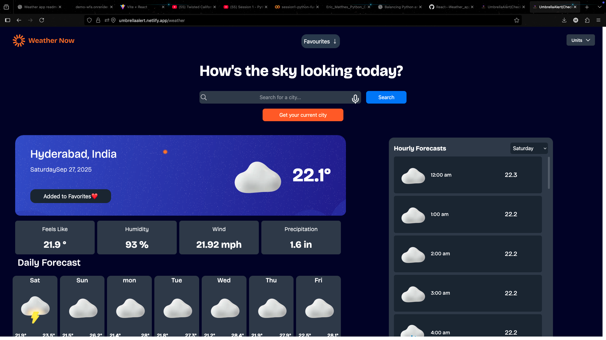
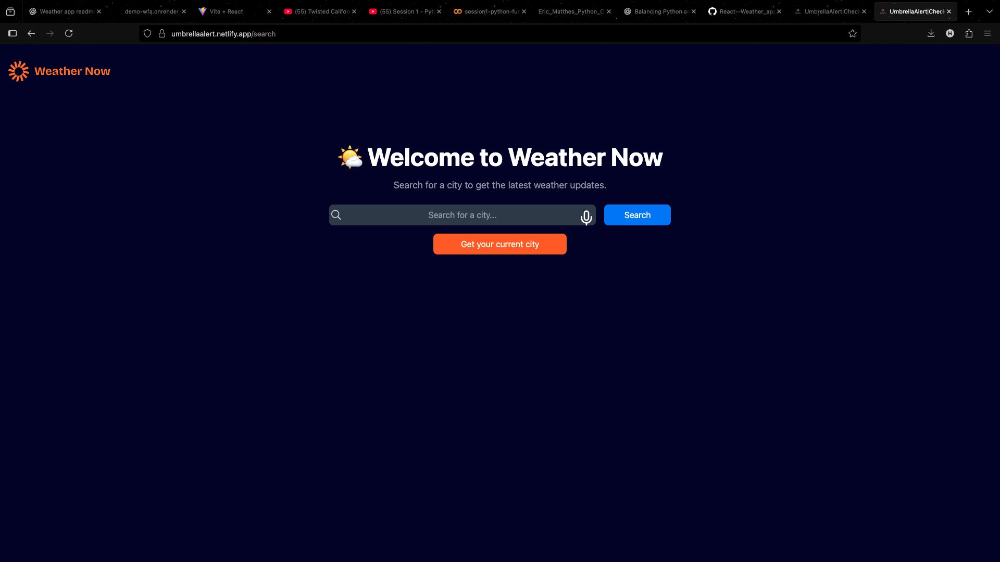
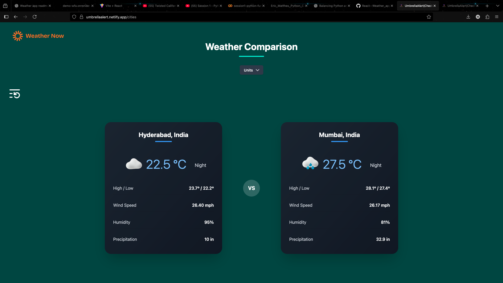
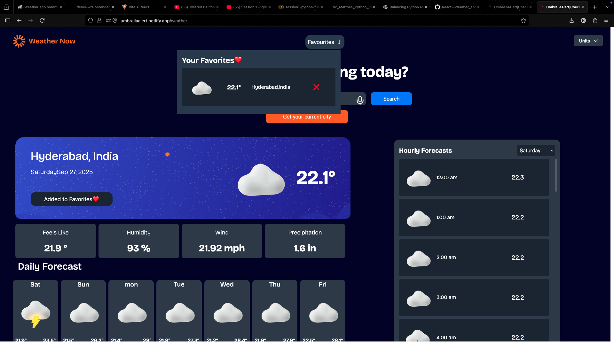
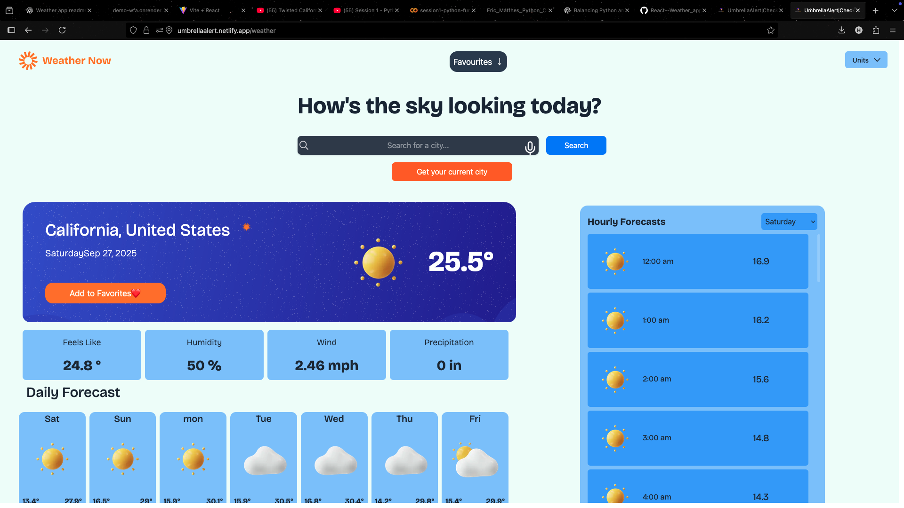

# 🌦️ UmbrellaAlert – Advanced Weather Dashboard

**UmbrellaAlert** is a modern, feature-rich weather web application built using **React + Vite**.  
It allows users to view real-time, hourly, and daily weather data, compare two cities, and even search using **voice commands**.  
The app intelligently detects **day/night** and automatically switches between **light and dark modes**, offering an intuitive and visually appealing experience.

🔗 **Live Demo:** [umbrellaalert.netlify.app](https://umbrellaalert.netlify.app/)

---

## 🚀 Features

### 🌍 Smart Dashboard

- Search weather by **city name** or **voice command**
- Detects **current location** using the **Geolocation API**
- Displays **current**, **hourly**, and **7-day** forecasts

### 🌗 Dynamic UI

- **Auto theme switch** between light/dark based on time of day
- Smooth transitions and clean, minimal UI

### ⚙️ Customization

- Toggle between **metric** and **imperial** units  
  (°C / °F, m/s / km/h, hPa / inHg)

### 🏙️ City Comparison

- Compare **two cities** side by side
- View temperature, humidity, wind, and pressure differences

### 🎙️ Voice Commands

- Search cities hands-free using **Web Speech API**

### ⭐ Favorites Tab

- Save your **favorite cities** for quick access
- Favorites are managed using the **React Context API**
- Persistent across sessions using local storage (if implemented)

### 📍 Location Detection

- Uses **HTML5 Geolocation API** to automatically detect user’s city

---

## 🧠 Tech Stack

| Category           | Technology            |
| ------------------ | --------------------- |
| Frontend           | React (Vite)          |
| Routing            | React Router DOM      |
| State Management   | React Context API     |
| Styling            | Tailwind CSS          |
| Lazy Loading       | React.lazy + Suspense |
| Speech Recognition | Web Speech API        |
| Geolocation        | HTML5 Geolocation API |
| Weather Data       | OpenWeatherMap API    |
| Deployment         | Netlify               |

---

## 🧩 Architecture Overview

The app is modular, context-driven, and designed for scalability.
src/
├── components/
│ ├── LoaderFullScreen.jsx
│ └── ...
├── contexts/
│ ├── UnitsContext.jsx
│ ├── WeatherContext.jsx
│ ├── CompareContext.jsx
│ ├── FavoritesContext.jsx
│ └── ...
├── pages/
│ ├── Home.jsx
│ ├── SearchHome.jsx
│ ├── SearchWeather.jsx
│ ├── CompareHome.jsx
│ ├── WeatherCompare.jsx
│ └── Favorites.jsx
├── App.jsx
└── main.jsx

Each **context** (Weather, Units, Compare, Favorites) provides shared global state to all pages.

---

## ⚡ Installation & Setup

### 1️⃣ Clone the Repository

```bash
git clone https://github.com/yourusername/umbrellaalert.git
cd umbrellaalert
```

### 2️⃣ Install dependencies

```
npm install
```

### 3️⃣ Add environment Variables

```
VITE_WEATHER_API_KEY=your_api_key_here
```

### 4️⃣ Run the App locally

```
npm run dev
```

# 🖼️ Screenshots

### 🏠 Home Dashboard

Displays current weather of your location or searched city.


---

### 🔍 Search Page

Search for any city manually or using **voice input**.


---

### 🌆 Compare Weather

Compare two different cities side-by-side with detailed metrics.


---

### ⭐ Favorites Tab

Save frequently checked cities and revisit them quickly.


---

### 🌗 Dark Mode

UI automatically switches between **light** and **dark** mode depending on time of day.



---

### 🌐 Live Demo

- 🚀 UmbrellaAlert: umbrellaalert.netlify.app

### 🧠 Future Enhancements

- 🌎 Interactive world map for weather visualization

- 📱 PWA support for offline access

- 🔔 Custom weather alerts and notifications

- 🗓️ Historical weather trends

- 🧭 Auto-refresh for favorite cities

### 👨‍💻 Author

Hussain Taher Kagalwala
Frontend Developer | AI/ML Enthusiast

### 🪪 License

This project is open-source and available under The Frontend Mentor .
